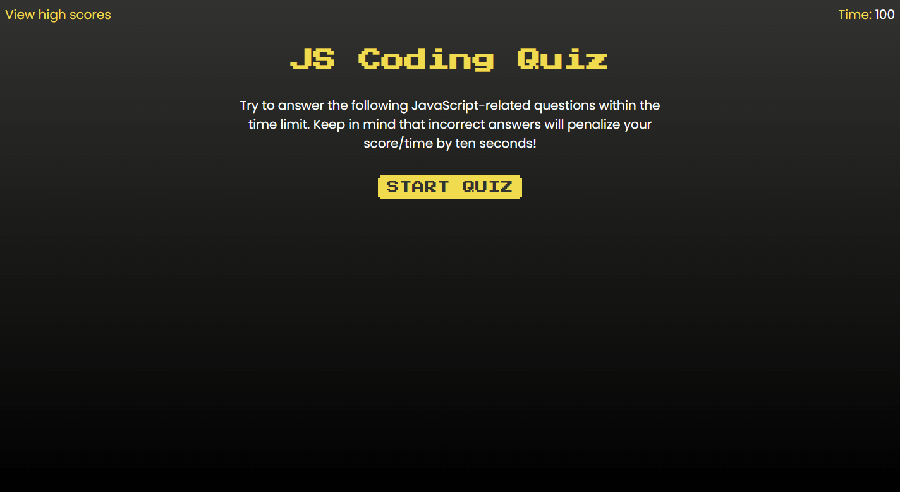

# JS Coding Quiz
A timed quiz on JavaScript fundamentals that tracks high scores.

## Features
- Save your personal high scores using up to 3 initials, arcade style... but only if you make it through the last question.
- If the timer hits zero, you get a GAME OVER screen and have to try again.
- You can view the high score list before you start the quiz or after you've completed it.
- If you want to start fresh, you can use the CLEAR HIGH SCORES button to delete all scores.

## Screenshot

## Links
- [Deployed Site](https://ckboytgt.github.io/javascript-quiz/)
- [GitHub Repo](https://github.com/CKBoytGT/javascript-quiz)

## Credit
- [ReindeerCode's Web APIs Code Quiz](https://github.com/ReindeerCode/Web-APIs-Code-Quiz) - Methods for getting the question details from an array and storing the initials and scores.
